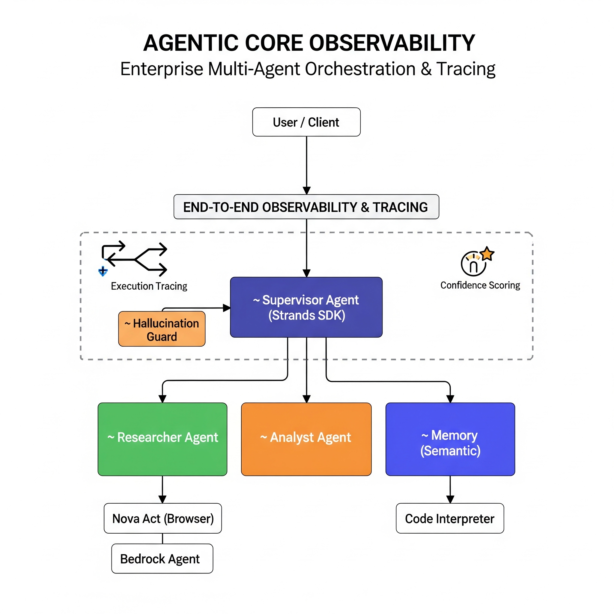

# 🔭 Agentic Core Observability

[](LICENSE)
[](https://python.org)
[](https://aws.amazon.com/bedrock/)
[](https://github.com/strands-agents/sdk-python)
[](https://aws.amazon.com/agentcore/)
[](https://ataylor.getform.com/5w8wz)

> **Advanced AI architecture demonstrating enterprise orchestration using Bedrock Agents, Strands SDK, and AgentCore Runtime.**

*Multi agent routing · Observability tracing · Hallucination detection · Semantic memory · Agent-to-Agent orchestration*

---

## 💡 The Problem

Multi-agent systems are powerful — but opaque. When a supervisor routes tasks to specialist agents, you have no visibility into why it chose a particular path, whether it is stuck in a loop, or if confidence is degrading. Silent hallucination spirals burn tokens and produce garbage. Without end-to-end tracing, debugging agent workflows is guesswork.

---

## ✨ The Solution

Wire up a Strands SDK supervisor that routes tasks to specialized agents, deploy the whole thing on AgentCore Runtime with semantic memory baked in, and connect managed Bedrock Agents through the Gateway for true Agent-to-Agent orchestration. Then wrap every layer in observability so you can actually see what your agents are doing and catch them before they spin out.

| Layer | What It Does | Status |
|-------|-------------|--------|
| 🧠 **Supervisor Agent** | Intent classification and routing (RESEARCH / ANALYSIS / GENERAL) | ✅ Live |
| 🔍 **Researcher Agent** | Source retrieval via Nova Act browser + Bedrock A2A Gateway | ✅ Live |
| 📊 **Analyst Agent** | Data interpretation in sandboxed Code Interpreter | ✅ Live |
| 💾 **Semantic Memory** | Vector similarity recall of user preferences across sessions | ✅ Live |
| 🛡️ **Hallucination Guard** | Loop detection and circuit-breaking on repetitive patterns | ✅ Live |
| 📈 **Observability Stack** | X-Ray tracing, structured logging, confidence scoring | ✅ Live |

---

## 🏗️ Architecture

```
                     +---------------------+
                     |   User / Client     |
                     +----------+----------+
                                |
                                v
                     +----------+----------+
                     |  Supervisor Agent    |  <-- Strands SDK Orchestrator
                     |  (Intent Router)     |
                     +----+----------+-----+
                          |          |
               +----------+    +-----+--------+
               |               |              |
          +----v----+   +-----v-----+  +------v------+
          |Researcher|  |  Analyst   |  |  Semantic   |
          |  Agent   |  |   Agent    |  |  Memory     |
          +----+-----+  +-----+-----+  +-------------+
               |               |
    +----------+-----+ +------+--------+
    | Bedrock Agent  | | Code          |
    | (A2A Gateway)  | | Interpreter   |
    +----------------+ +---------------+
```

**Supervisor Agent** receives every request, classifies intent (RESEARCH / ANALYSIS / GENERAL), and routes to the right specialist. It maintains a full execution trace and runs hallucination-loop detection on every cycle.

**Researcher Agent** gathers information from authoritative sources using the AgentCore Browser tool (Nova Act) and delegates deep synthesis tasks to a managed Bedrock Agent via the A2A Gateway.

**Analyst Agent** interprets data and identifies trends using the AgentCore Code Interpreter in a sandboxed Python environment.

**Semantic Memory** stores and recalls user preferences (report format, preferred sources, analysis depth) so the system gets smarter with each session.

For the full technical breakdown, see [docs/ARCHITECTURE.md](docs/ARCHITECTURE.md).

---

## 🎯 Use Cases

### 1. Enterprise Research Automation

Deploy the Researcher Agent to continuously monitor and synthesize information from multiple sources — regulatory filings, competitor announcements, market reports — with full provenance tracking and confidence scoring on every finding.

### 2. Real-Time Operational Analytics

Route live telemetry and business metrics through the Analyst Agent for automated trend detection, anomaly flagging, and comparison analysis. The sandboxed Code Interpreter executes custom Python analyses on demand without infrastructure risk.

### 3. AI-Augmented Customer Support

Use the Supervisor's intent classification to triage incoming requests, retrieve relevant knowledge via semantic memory, and generate grounded responses. Hallucination loop detection ensures the system never spirals into fabricated answers.

### 4. Multi-Agent DevOps Orchestration

Coordinate incident response across specialized agents — one retrieves logs and traces via the Browser tool, another analyzes error patterns in the Code Interpreter, while semantic memory recalls past incident resolutions and runbooks for faster MTTR.

---

## 🚀 Quick Start

### Prerequisites

- Python 3.12+
- AWS CLI configured with valid credentials
- Access to Amazon Bedrock models

### Installation

```bash
# Clone the repository
git clone https://github.com/ATaylorAerospace/Agentic-Core-Observability.git
cd Agentic-Core-Observability

# Install as an editable package (recommended)
pip install -e .

# Or install dependencies directly
pip install -r src/requirements.txt

# Verify your environment
python -m tests.test_connection
```

### Run the Agent

```bash
# Interactive mode
python -m src.app

# With custom configuration
python -m src.app --model-id us.anthropic.claude-sonnet-4-20250514 --region us-east-1 --user-id your-user-id
```

### Deploy Infrastructure

```bash
cd cdk
pip install -r ../src/requirements.txt
cdk bootstrap
cdk deploy
```

### Verify the Connection

Run the built-in test script to check that everything is wired up:

```bash
python -m tests.test_connection
```

This runs 5 checks: AWS credentials, Bedrock model access, Strands SDK import, Supervisor initialization, and tool registration. Green across the board means you are good to go.

---

## 🛠️ Multi-Protocol Tooling

This repository demonstrates three distinct integration patterns running in a single workflow:

| Protocol | Component | Purpose |
|---|---|---|
| **Strands Native** | Supervisor, Researcher, Analyst | Direct tool invocation via `@tool` decorators |
| **AgentCore Gateway (A2A)** | Bedrock Research Agent | Agent-to-Agent orchestration across managed and custom agents |
| **AgentCore Built-in** | Code Interpreter, Browser (Nova Act) | Sandboxed code execution and live web navigation |

### Tool Registry

- `research_tool` - Structured source retrieval with confidence scoring
- `analysis_tool` - Multi-mode data analysis (summary, trend, comparison, sentiment) with input validation logging
- `memory_store_tool` - Persist content to AgentCore semantic memory
- `memory_recall_tool` - Vector similarity search over stored memory
- `http_request` - Direct HTTP calls via Strands tools
- **Code Interpreter** - Sandboxed Python execution (AgentCore built-in)
- **Browser / Nova Act** - Headless web navigation with domain allowlisting

---

## 📊 Observability & Tracing

This is the heart of the project. Every agent interaction is observable at multiple levels:

### Hallucination Loop Detection

The Supervisor monitors its own execution trace for repetitive routing patterns. When the same action fires N times without meaningful progress, the circuit breaks:

```python
# The agent stops itself and tells you why
{
    "response": "I detected a repetitive pattern in my reasoning and stopped...",
    "loop_detected": true,
    "trace": [...]
}
```

No more silent hallucination spirals burning tokens in a loop. The agent catches itself, stops, and gives you a transparent explanation.

### Confidence Scoring

Every tool response includes a `confidence` field. Responses below the threshold (default 0.85) trigger additional verification or a low-confidence disclaimer to the user.

### Trace Inspection

Pull the full execution trace at any time during an interactive session. Every trace entry includes a UTC timestamp for latency analysis and event correlation:

```
You > trace
[
  {
    "action": "supervisor_response",
    "input_preview": "Research the latest trends in...",
    "session_id": "a1b2c3d4-...",
    "user_id": "default",
    "timestamp": "2026-03-28T14:32:01.456789+00:00"
  }
]
```

### AWS X-Ray Integration

Distributed tracing across all agent invocations, memory lookups, and Gateway calls. Configured in `.agentcore/config.yaml` with a default sample rate of 1.0 (every request traced).

### Structured Logging

JSON-formatted logs with trace IDs for correlation. Query patterns across sessions using CloudWatch Log Insights. Invalid tool inputs (such as unrecognized `analysis_type` values) are logged at WARNING level for easy debugging.

---

## 🧩 Components

### 🧠 Supervisor Agent (`src/agents/supervisor.py`)
Receives every request, classifies intent, and routes to specialists. Maintains a full execution trace with UTC timestamps and runs hallucination-loop detection on every cycle. Exposes `delegate_research()` and `delegate_analysis()` methods for explicit sub-agent delegation with full trace recording.

### 🛠️ Custom Tools (`src/agents/tools.py`)
`@tool`-decorated functions for research, analysis, and memory operations with built-in confidence scoring. Invalid inputs are caught and logged at WARNING level before falling back to safe defaults.

### 💾 AgentCore Config (`.agentcore/config.yaml`)
Runtime, memory, and gateway configuration — semantic memory, X-Ray tracing, and Bedrock Agent A2A routing.

### 🏗️ CDK Infrastructure (`cdk/agent_stack.py`)
Full AWS stack — Bedrock Agent, IAM roles, S3 buckets, and CloudWatch log groups deployed via CDK. The `cdk/cdk.json` file provides CDK CLI compatibility for `cdk synth`, `cdk diff`, and `cdk deploy`.

### 🧪 Connection Tests (`tests/test_connection.py`)
5-point environment verification: AWS credentials, Bedrock access, SDK import, Supervisor init, and tool registration.

### 🧪 Hallucination Loop Tests (`tests/test_hallucination_loop.py`)
Dedicated unit tests for the hallucination-loop detection logic — covers empty traces, threshold boundaries, varied vs identical actions, custom thresholds, and edge cases.

---

## 📁 Repository Structure

```
Agentic-Core-Observability/
├── .agentcore/
│   └── config.yaml              # AgentCore runtime, memory, and gateway config
├── src/
│   ├── agents/
│   │   ├── __init__.py          # Module exports
│   │   ├── supervisor.py        # Strands Supervisor/Orchestrator agent
│   │   └── tools.py             # Custom @tool definitions
│   ├── app.py                   # Application entry point
│   └── requirements.txt         # Python dependencies
├── cdk/
│   ├── app.py                   # CDK application entry
│   ├── agent_stack.py           # Infrastructure stack (Bedrock, IAM, S3, Logs)
│   └── cdk.json                 # CDK CLI configuration
├── docs/
│   └── ARCHITECTURE.md          # Detailed architecture documentation
├── tests/
│   ├── __init__.py              # Test package init
│   ├── test_connection.py       # Environment and connection verification
│   └── test_hallucination_loop.py  # Unit tests for loop detection logic
├── .gitignore                   # Git ignore rules for Python, IDE, CDK, OS files
├── pyproject.toml               # Modern Python packaging and tool configuration
├── CONTRIBUTING.md              # Contribution guidelines and PR workflow
├── CHANGELOG.md                 # Version history and release notes
├── LICENSE
└── README.md
```

---

## 🔐 Security

- S3 buckets enforce `BlockPublicAccess.BLOCK_ALL` with versioning enabled
- Bedrock Agent roles follow least-privilege IAM policies
- Code Interpreter runs in a sandboxed environment with execution time limits
- Browser tool restricts navigation to an explicit domain allowlist
- No credentials stored in code; all secrets use environment variables or AWS IAM roles

---

## 🧪 Testing

```bash
# Verify environment and connections
python -m tests.test_connection

# Run the full test suite with pytest
pytest tests/ -v

# Run only hallucination loop detection tests
pytest tests/test_hallucination_loop.py -v

# Run with coverage reporting
pytest tests/ -v --cov=src --cov-report=term-missing
```

---

## 🤝 Contributing

Contributions are welcome! Please read [CONTRIBUTING.md](CONTRIBUTING.md) for the development setup, branching strategy, and PR guidelines before submitting changes.

---

## 📋 Changelog

See [CHANGELOG.md](CHANGELOG.md) for a complete version history and release notes.

---

## 📜 License

This project is licensed under the MIT License. See [LICENSE](LICENSE) for details.

Copyright (c) 2026 A Taylor. All rights reserved.

---

## 📬 Contact

Have questions, ideas, or want to collaborate? Reach out directly:

**A Taylor** ·<p align="left">
  <a href="https://ataylor.getform.com/5w8wz">
    
  </a>
</p>
---
